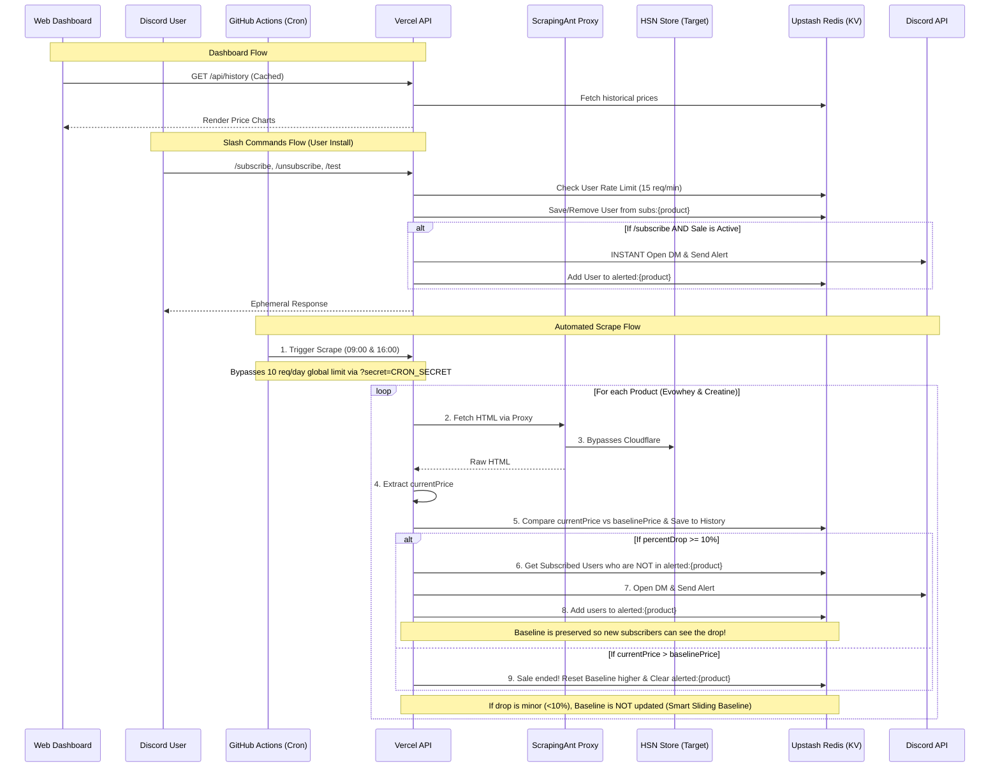

# HSN Price Scraper & Discord Bot 🏋️‍♂️

This is a scraper to get the price of whey protein and creatine from the HSN Store. It automatically tracks the price over time using a scheduled cron job and immediately pings you via a Discord Direct Message if a flash sale or price drop is detected!

## 🏗 Architecture & Flow

The system is fully automated and serverless, utilizing GitHub Actions, Vercel, ScrapingAnt, and Upstash Redis.

## ✨ Features
1. **Multi-Product Tracking**: Simultaneously tracks multiple products (Evowhey, Creatine 1Kg).
2. **Web Dashboard & Chart**: A beautiful, localized (English/Portuguese) Next.js frontend showing daily historical price drops using `recharts`.
3. **Instant Mid-Sale Alerts**: If someone types `/subscribe` while a sale is currently active, the bot detects it and instantly sends them a DM on the spot!
4. **Smart Sliding Baseline**: Perfectly handles slow, multi-day creeping flash sales by refusing to lower the internal baseline until a full 10% drop occurs!
5. **Automated Scraping**: Runs exactly at 9 AM and 4 PM local time using GitHub Actions.
6. **Cloudflare Evasion**: Uses the ScrapingAnt Proxy API (bypassing heavy headless browsers) to fetch HSN pricing fast and reliably.
7. **Discord Bot & DM Alerts**: Supports **User Installs**! Users can add the bot directly to their profile and type `/subscribe` in DMs. Includes `/unsubscribe` and a `/test` drive command.
8. **Anti-Spam Security**: 
   - Global Scraper Limit: Maximum 10 public requests per day (Cron jobs bypass this using a private `CRON_SECRET`).
   - Discord Bot Limit: Strict limit of 15 slash commands per minute per user to protect the database from malicious spam bots.

## 🚀 Setup & Environment Variables

Make sure the following environment variables are set in your **Vercel** project:

- `SCRAPINGANT_API_KEY`: Your ScrapingAnt token.
- `DISCORD_TOKEN`: Your bot's authorization token (so it can send messages).
- `DISCORD_PUBLIC_KEY`: Used to verify `/subscribe` commands securely.
- `KV_REST_API_URL` & `KV_REST_API_TOKEN`: Automatically generated if you use Upstash on Vercel.
- `CRON_SECRET`: A secret string you invent to secure your endpoint.

Make sure to add `CRON_SECRET` to your **GitHub Repository Secrets** as well so the GitHub Action can authenticate!
