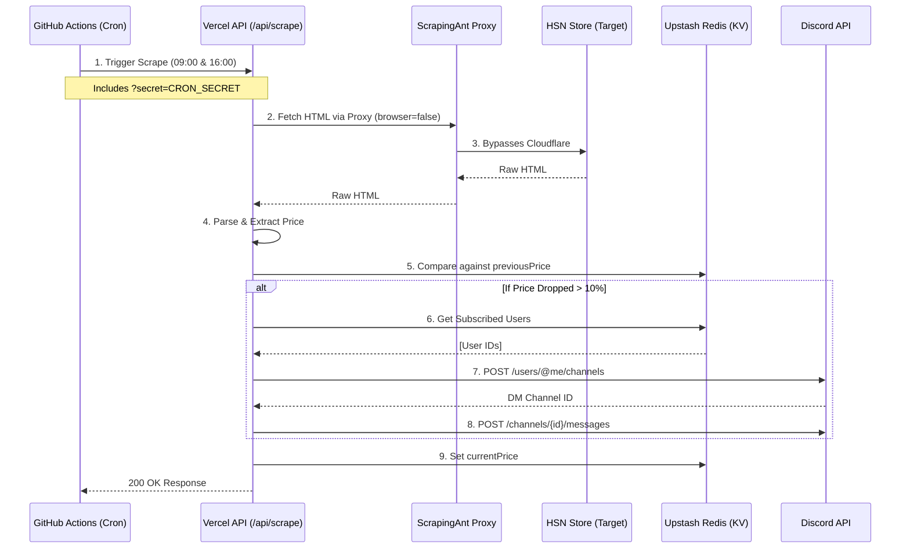

# HSN Price Scraper & Discord Bot 🏋️‍♂️

This is a scraper to get the price of whey protein and creatine from the HSN Store. It automatically tracks the price over time using a scheduled cron job and immediately pings you via a Discord Direct Message if a flash sale or price drop is detected!

## 🏗 Architecture & Flow

The system is fully automated and serverless, utilizing GitHub Actions, Vercel, ScrapingAnt, and Upstash Redis.

## ✨ Features
1. **Automated Scraping**: Runs exactly at 9 AM and 4 PM local time using GitHub Actions.
2. **Cloudflare Evasion**: Uses the ScrapingAnt Proxy API (bypassing heavy headless browsers) to fetch HSN pricing fast and reliably.
3. **Database Memory**: Upstash Redis tracks the previous price to calculate percentage drops.
4. **Discord Bot**: Type `/subscribe` directly in a DM to the bot, and it will message you automatically when a flash sale occurs.
5. **Abuse Protection**: Global rate limiting (max 10 public requests per day) and a private `CRON_SECRET` to prevent API abuse and quota drainage.

## 🚀 Setup & Environment Variables

Make sure the following environment variables are set in your **Vercel** project:

- `SCRAPINGANT_API_KEY`: Your ScrapingAnt token.
- `DISCORD_TOKEN`: Your bot's authorization token (so it can send messages).
- `DISCORD_PUBLIC_KEY`: Used to verify `/subscribe` commands securely.
- `KV_REST_API_URL` & `KV_REST_API_TOKEN`: Automatically generated if you use Upstash on Vercel.
- `CRON_SECRET`: A secret string you invent to secure your endpoint.

Make sure to add `CRON_SECRET` to your **GitHub Repository Secrets** as well so the GitHub Action can authenticate!
